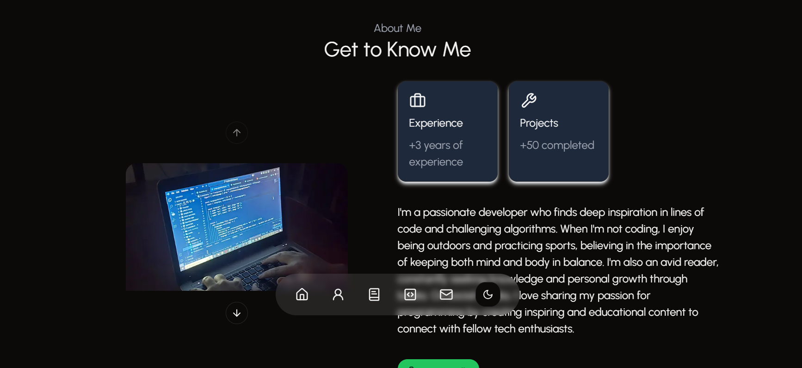

# Landing Page Portfolio

Welcome to my personal portfolio landing page built with Next.js 14, React 18, and TailwindCSS.

## 📸 Preview

 

## 🚀 Features

- **Next.js 14** for SSR and static generation.
- **React 18** with hooks and modern features.
- **TailwindCSS 3.4** for rapid, utility-first styling.
- **Dark/Light theme toggle** powered by `next-themes`.
- **TypeScript** strict mode for robust code.
- **Form validation** using `react-hook-form` with `zod` and `@hookform/resolvers`.
- **Animations** with `tailwindcss-animate` and `lucide-react` icons.
- **Carousel/Slider** using `embla-carousel-react`.
- **Email sending** integrated with `resend` API.
- **Radix UI components** (`dropdown-menu`, `label`, `progress`, `separator`, `slot`) for accessible UI primitives.
- Clean code structure and reusable components.


## 🛠 Installation

Clone the repository:

```bash
git clone https://github.com/yourusername/landing-page-portfolio.git
cd landing-page-portfolio

1.Install dependencies:

npm install
# or
yarn install


2.Run development server:

npm install
# or
yarn install
Open http://localhost:3000 in your browser to see the portfolio.

3.🎨 Styling

-TailwindCSS with JIT mode enabled.

-tailwindcss-animate plugin for smooth animations.

-Custom theme switching with next-themes.

4. 📧 Email Integration

Uses resend package to send emails easily from contact forms.

5. 🎡 Carousel/Slider

Implemented with embla-carousel-react for smooth touch and mouse interactions.

Developed by Steven 👨‍💻